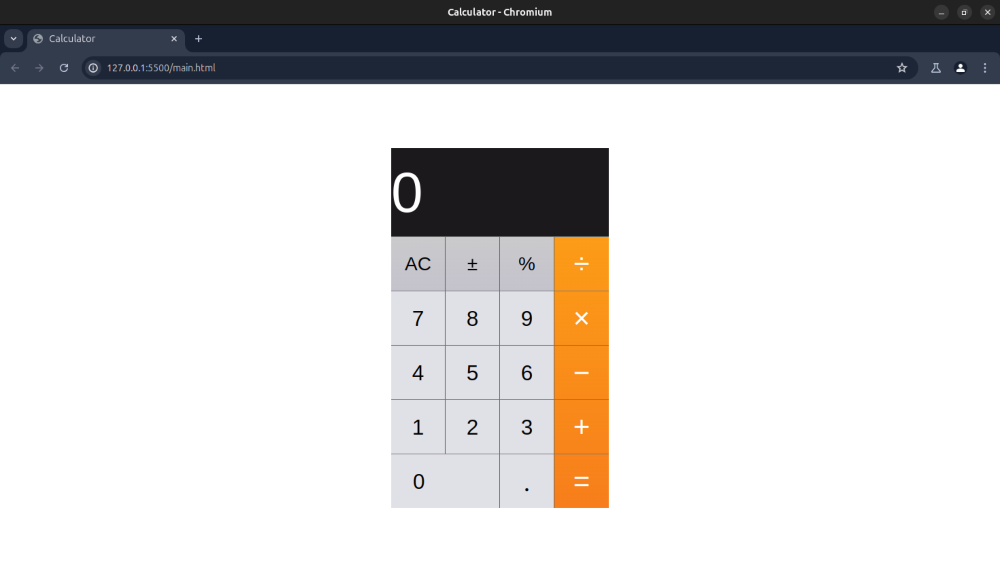

<div align = "center">
  
# Calculator Webpage

</div>


This project is a simple calculator implemented using HTML, CSS, and JavaScript. It includes basic arithmetic operations and additional functionalities such as toggling the sign of a number and calculating percentages.

## Features

- Basic arithmetic operations: addition, subtraction, multiplication, and division.
- Support for decimal numbers.
- Toggle the sign of the current number.
- Calculate percentages.
- Clear all or the current input.

## Getting Started

Follow these instructions to get a copy of the project up and running on your local machine.

### Prerequisites

To run this project, you need a modern web browser. No additional installations are required.

### Installation

1. Clone the repository to your local machine or download the zip file.

```bash
git clone https://github.com/Gautamhirawat/CODSOFT.git
```

2. Navigate to the project directory.

```bash
cd LEVEL1/CALCULATOR
```

3. Open the `calc.html` file in your preferred web browser.

## Usage

### User Interface

- **Display**: Shows the current number or the result of an operation.
- **Digit Keys (0-9)**: Input numbers.
- **Dot Key (●)**: Input decimal point.
- **Operator Keys (÷, ×, −, +)**: Perform arithmetic operations.
- **Equals Key (=)**: Calculate the result of the operation.
- **Function Keys (AC, ±, %)**:
  - **AC**: Clear all input.
  - **±**: Toggle the sign of the current number.
  - **%**: Convert the current number to a percentage.

### Keyboard Support

- **Digits (0-9)**: Input numbers.
- **Dot (.)**: Input decimal point.
- **Operators (/ * - +)**: Perform arithmetic operations.
- **Enter**: Calculate the result of the operation.
- **Backspace**: Clear the last character.
- **Clear**: Clear all input.

## Code Overview

### HTML

The HTML file contains the structure of the calculator, including the display, digit keys, operator keys, and function keys.

### CSS

The CSS file styles the calculator, providing layout, colors, and responsiveness.

### JavaScript

The JavaScript file manages the calculator's state and functionality. It includes functions for handling input, performing calculations, and updating the display.

#### Key Functions

- `updateDisplay()`: Updates the display with the current value.
- `clearAll()`, `clearDisplay()`, `clearLastChar()`: Handle clearing input.
- `toggleSign()`: Toggles the sign of the current number.
- `inputPercent()`: Converts the current number to a percentage.
- `inputDot()`, `inputDigit(digit)`: Handle input of decimal points and digits.
- `performOperation(nextOperator)`: Performs arithmetic operations based on the current state.

## Snapshot



## Contributing

If you would like to contribute to this project, please fork the repository and create a pull request with your changes.

## License

This project is licensed under the MIT License. See the [LICENSE](LICENSE) file for details.

## Acknowledgments

- Inspired by the design and functionality of standard calculators.

