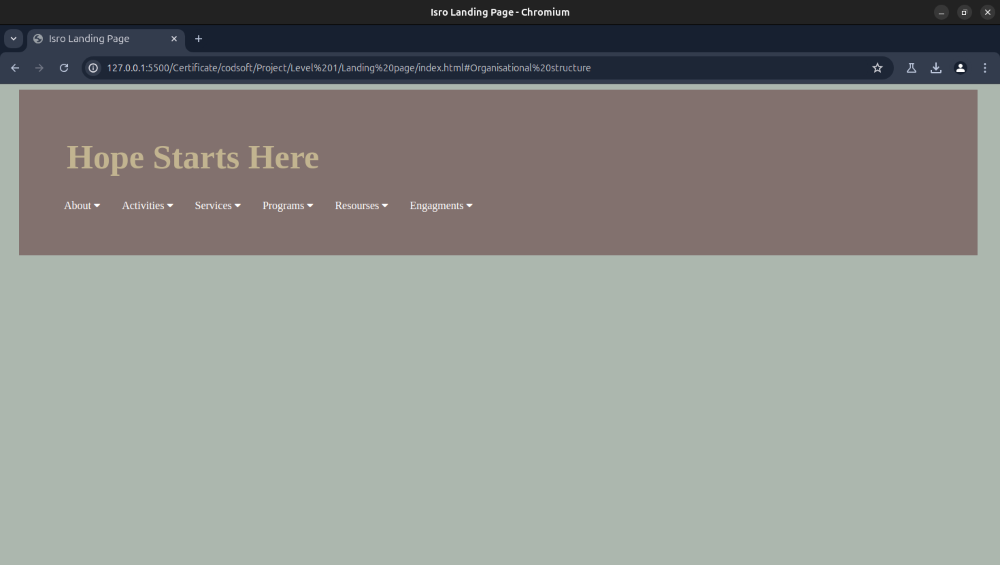
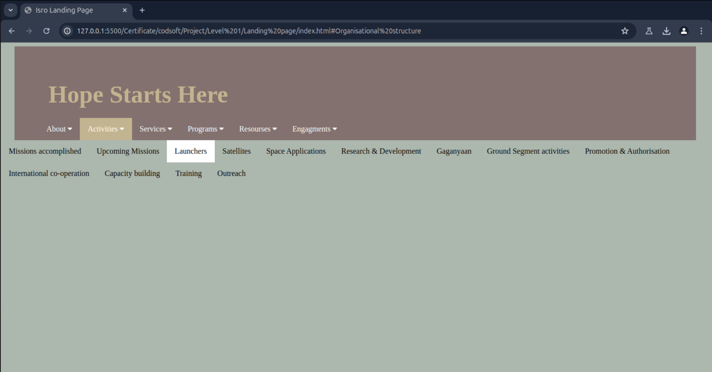

<br><br>

<div align = "center">
  
# Landing Page of Isro

</div>

## Task

<p>
A landing page is an ideal web development project for beginners. It requires basic
knowledge of HTML and CSS. Through this project, you'll learn to create columns, divide
sections, arrange items, and add headers and footers. The most important aspect is
unleashing your creativity to design an impressive page. Pay attention to alignments,
padding, color palette, boxes, and other elements. Be mindful of CSS to avoid overlapping
elements. In short, a landing page project allows you to apply HTML and CSS skills,
encouraging your creativity while ensuring a visually appealing and user-friendly design.
</p>


## Date and Progress

<details>
<summary> Progress </summary>
  
> **_Date_** : 22 June -- Learning basic things about div and navbar and header.

> **_Date_** : 23 June -- Starting to make the Landing page made html , css and js files. 

> **_Date_** : 24 June -- Decided the color pallete and theme of the webpage {theme: Mordern Isro Website}

> **_Date_** : 25 June -- Completing the navbar and appling the color pallete

</details>


<details>
<summary> Color Pallete </summary>

```
Barely Green: #acb7ae

The Brown-shirts: #82716e

Tan Blonde: #e4decd

Blondey: #c2b490
```
</details>
    
### Snapshots

*Webpage view*<br>


*Header Working view*<br>

